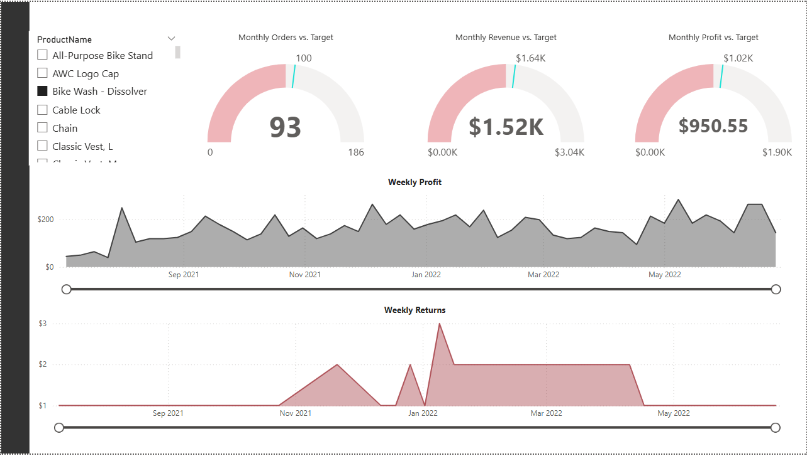
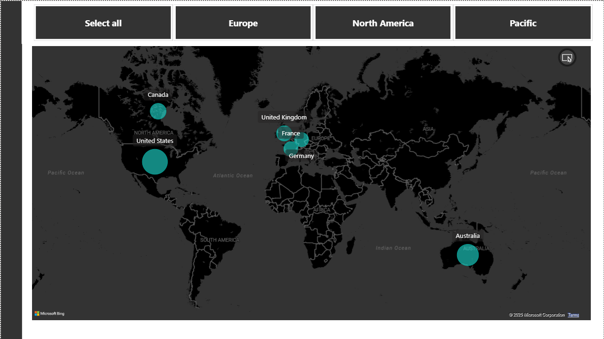

# powerbi-adventureworks-sales
# AdventureWorks – Sales Analytics Dashboard (Power BI)

## Project Context
This project was created as part of a *hands-on Power BI course* using the *AdventureWorks sample dataset*, a fictional company widely used for analytics training.

The objective was to design an *end-to-end sales analytics solution* — from data modeling to executive-level insights.

## Business Questions Addressed
- How are overall sales and profits trending over time?
- Which products and categories drive the highest revenue?
- Which products have higher return rates?
- Who are the most valuable customers?
- How is sales performance distributed geographically?

## Key Dashboards & Insights
### 1. Executive Overview
- Total sales, profit, orders
- Monthly and yearly trends
- High-level KPIs for leadership

### 2. Product Performance
- Top 10 selling products
- Product category contribution
- Product return rate analysis

### 3. Customer Analysis
- Customer contribution to total sales
- High-value customer identification
- Revenue distribution by customer segments

### 4. Geographic Analysis
- Sales distribution by region and country
- Market concentration insights

## Tools & Skills Demonstrated
- Power BI Desktop
- Data modeling and relationships
- DAX measures and calculated columns
- Sales and customer analytics
- Dashboard storytelling for executives

## Dashboard Preview

## Notes
- Dataset: AdventureWorks (fictional company)
- Created for learning and portfolio demonstration purposes
